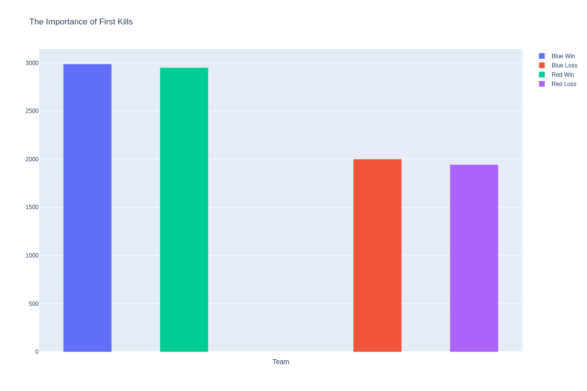

# LoL-MatchOutcome-Predictor
Using a data set of 10k Diamond and Master games along with the Riot Games API to get even more data about each game in the data set to predict the outcome of games.

# EDA

### Target

The target variable that I will attempt to determine is whether the team will win the game or not. In the data set, this is given as "blueWins", which really doesn't matter as we will be able to tell when red wins (if blue loses)

It appears that wins and loses is distributed almost equally throughout the data set, which is good. This means I don't need to manually compensate for an uneven amount of wins/losses and essentially "guess" whether a team won or not just to make the distriubtion even.

Red has 4949 wins  
Blue has 4930 wins

### Wards Placed

Having more information than your opponent in any game is one of the biggest advantages a team can have over another. Therefore, wards are extremely important for the success of a team as they grant extra vision of the enemy and map.

On average, about 20 wards a game are placed. It is interesting and mind boggling how some games have up to 276 wards placed.

It is clear that the distribution of wards placed is left skewed and will require a transformation we fit the data to a model.

Here we can see that there is a slight trend with the amount of wards placed and a team winning. Usually the winning team has a larger amount of wards placed that game.

Both blue and red have a higher mean of wards placed when winning, but it is not that clear for blue side as it is with red.

### Wards Destroyed

Similar to wards being so important due to the information they can provide to the team, denying that information is also key to winning. Due to this idea, I would suspect that the team with more destroyed wards has a better chance of winning the game.

In the range of 0-2 wards destroyed, there isn't a trend at all regarding the outcome of the game. Once the wards destroyed count exceeds 3, there is a clear trend that destroyed ward count correlates with winning. This is most likely due to the fact that if so many wards are destroyed that quickly, the team is dominating / being very aggressive and putting a lot of pressure on the other time.

### First Kills

First bloods are important because it provides gold for the team, which allows wards to be set up early. This will prevent the jungler from ganking as well.

This bar graph takes the sum of games where a certain team got fiirst blood. It is clear that teams that got a first kill are more likely to win, since it does provide advantages as stated earlier.
  
But it is also possible that the team was just overall better and won regardless of the "first blood advantage".