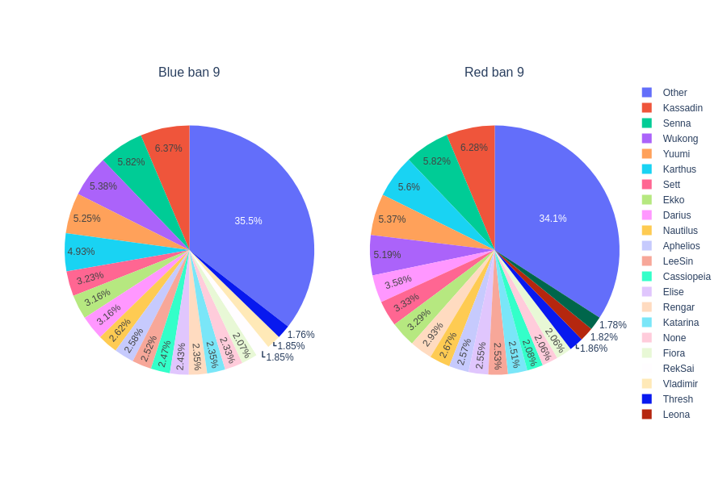

# LoL-MatchOutcome-Predictor
Using a data set of 10k Diamond and Master games with data from the first 10 min, along with the Riot Games API to get even more data about each game in the data set to predict the outcome of games.

# EDA

### Target

The target variable that I will attempt to determine is whether the team will win the game or not. In the data set, this is given as "blueWins", which really doesn't matter as we will be able to tell when red wins (if blue loses)

It appears that wins and loses is distributed almost equally throughout the data set, which is good. This means I don't need to manually compensate for an uneven amount of wins/losses and essentially "guess" whether a team won or not just to make the distriubtion even.

Red has 4949 wins  
Blue has 4930 wins

### Wards Placed

Having more information than your opponent in any game is one of the biggest advantages a team can have over another. Therefore, wards are extremely important for the success of a team as they grant extra vision of the enemy and map.

On average, about 20 wards a game are placed. It is interesting and mind boggling how some games have up to 276 wards placed.

It is clear that the distribution of wards placed is left skewed and will require a transformation before fitting the data to a model.

Here we can see that there is a slight trend with the amount of wards placed and a team winning. Usually the winning team has a larger amount of wards placed that game.

Both blue and red have a higher mean of wards placed when winning, but it is not that clear for blue side as it is with red.

### Wards Destroyed

Similar to wards being so important due to the information they can provide to the team, denying that information is also key to winning. Due to this idea, I would suspect that the team with more destroyed wards has a better chance of winning the game.

In the range of 0-2 wards destroyed, there isn't a trend at all regarding the outcome of the game. Once the wards destroyed count exceeds 3, there is a clear trend that destroyed ward count correlates with winning. This is most likely due to the fact that if so many wards are destroyed that quickly, the team is dominating / being very aggressive and putting a lot of pressure on the other time.

### First Kills

First bloods are important because it provides gold for the team, which allows wards to be set up early. This will prevent the jungler from ganking as well.

This bar graph takes the sum of games where a certain team got fiirst blood. It is clear that teams that got a first kill are more likely to win, since it does provide advantages as stated earlier.
  
But it is also possible that the team was just overall better and won regardless of the "first blood advantage".

### Team Kills
Kills in League are very important because it slows down the progression of your opponents build, along with giving you gold to upgrade your champion. For this reason, it is pretty clear that kills will be a very important indicator of whether a team wins or loses

The distribution of all the variations in this histogram are right skewed slightly.

As expected, teams that have more kills generally win more games.

### Team Deaths
If kills are vital to the success of a team, it must mean that survivability is also very important. This means that most likely the team that dies least has the higher chance of winning.

As suspected, Teams that win tend to die less on average.

### Assists

The team with more assists also means that team has more kills which should give them the advantage over their opponents. I expect the team with more assists to win more games

It is evident that teams with more assists end up winning more games.

### Towers Destroyed

Towers prevent the enemy team from attacking the Nexus. The more towers that are destroyed, the easier it becomes to attack the Nexus.  
Due to this idea, teams that win would have destoryed more towers than their opponents.

In the first 10 min, usually no towers are destroyed. If one is destroyed, usually that team wins.

### Epic Monsters

Epic Monsters are important provide high gold/experience and buffs to the team that defeats them. This in turn provides an advantage for the team. I would expect to see that teams will win more on average if they kill more epic monsters.

Due to the rewards epic monsters provide, there is a definite advantage to the team with more monster kills.

### Total Experience

The more experience a champion has earned, the stronger the build the champion will have. Therefore teams that win will most likely have more experience.

### Total Gold

Stronger items and upgrades to items can be obtained with gold. So most likely the teams that win will have more gold since they had stronger champions that contributed to winning the game.

### CS Per Min

Creep Score, or CS, is one of the most important aspects of League. Having a good creep score means a reliable and steady amount of income, which is pointed out earlier is very important for winning games. Due to this, I know for sure that the winning teams will have higher CS than the losing teams.

### Champion Bans
These are the 20 most frequent bans when a team wins. Unfortunately the API doesn't give information on who picked first, so when it says "Blue" or "Red" it just means the team that won
In th legend, the champions go in order of most frequent. For example, Other is the most banned, followed by Kassadin in Ban 1.
#### Ban 1

#### Ban 2 

#### Ban 3
  
#### Ban 4 

#### Ban 5   

#### Ban 6 

#### Ban 7 

#### Ban 8  

#### Ban 9

#### Ban 10

It seems that people in diamond and master are not fond of Kassadin at all.
Generally, it seems that the ban selections are very strict at the top level of play.

### Champion Selections
#### Among Winning and Losing Teams

The idea presented by the pie chart makes sense, as usually team composition related games typically have metas between patches or seasons. So it makes sense to see champions that work best together to have pick rates close to one anothers.

#### Blue Winning
I suspect the choices to be relatively similar to the champion selection visualization embodying winning and losing teams
 
It's interesting to see that Lee Sin is selected more on Red when they lose. I don't think this contributes to Red losing though.
#### Red Winning

Interesting that when blue loses, Lee Sin is very popular. At the same time, Lee Sin is the third most fequent pick when Red wins.

  
